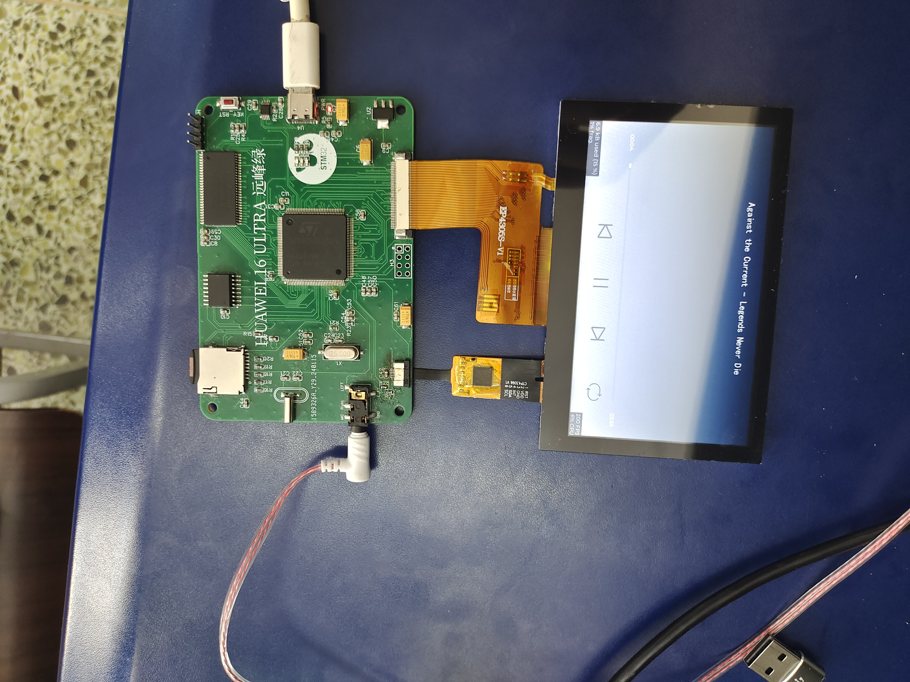

# 这是一个基于STM32、FreeRTOS、LVGL GUI的音乐播放器

## SD卡文件目录格式

sd:\
├─music
└─font

music 文件夹下存放.wav格式音频文件

font文件夹下存放字库文件

## 代码

.\mp4_v0.1下有两个工程

mp4_stm32h723zgt6_v0_1是音乐播放器工程

mp4_stm32h723zgt6_writeflash是flash烧录工程

使用前应先将使用mp4_stm32h723zgt6_writeflash将sd卡中的字库和图标等文件烧录进flash中

## 功能

1、播放.wav格式的音乐，显示音乐名称（支持中日英文显示），播放进度条显示

2、触屏能够切换上一首，下一首，暂停，播放模式（列表循环播放，单曲循环，随机播放）

3、通过硬件按键可调节音量，暂停/开始播放

